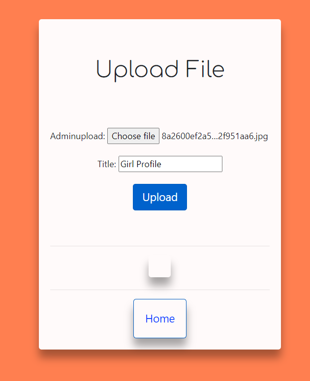
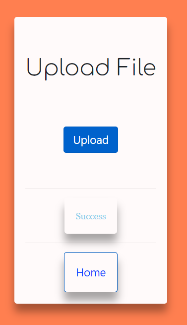

# ShareMovies 📽️

ShareMovies is a Django-based project that allows you to easily transfer files within your local network. Share movies, videos, documents, and more with your friends and colleagues hassle-free.

🚀 **Open for Contribution** - We welcome contributors to help make ShareMovies even better!

[](CONTRIBUTING.md)
[](LICENSE)
[](https://github.com/Ravikisha)


## Features

- 🌐 Easy and secure file transfer within your local network.
- 🎉 Intuitive web interface for uploading and downloading files.
- ⚡ Fast and efficient file sharing using Django.
- 📅 Detailed file history and management.

## Installation

To set up ShareMovies on your local environment, follow these steps:

1. **Clone the Repository:**

   ```bash
   git clone https://github.com/ravikisha/Sharemovies.git
   cd Sharemovies
   ```

2. **Create a Virtual Environment:**

   It's a good practice to create a virtual environment to isolate dependencies.

   ```bash
   python -m venv venv
   source venv/bin/activate
   ```

3. **Install Dependencies:**

   Install the required Python packages from the `requirements.txt` file.

   ```bash
   pip install -r requirements.txt
   ```

4. **Run Migrations:**

   Initialize the database by running migrations.

   ```bash
   python manage.py migrate
   ```

5. **Create a Superuser:**

   Create a superuser to access the admin panel.

   ```bash
   python manage.py createsuperuser
   ```

6. **Start the Development Server:**

   Start the Django development server.

   ```bash
   python manage.py runserver
   ```

7. **Access ShareMovies:**

   Open your web browser and visit `http://localhost:8000/` to access ShareMovies.

8. **Start Sharing:**

   You're all set! Begin sharing files within your local network.

## Screenshots




## Contributing

Contributions are welcome! If you'd like to contribute to ShareMovies, please check the [CONTRIBUTING.md](CONTRIBUTING.md) file for guidelines and instructions.

## License

This project is licensed under the MIT License. See the [LICENSE](LICENSE) file for details.

Enjoy sharing movies and files with ShareMovies! 🍿